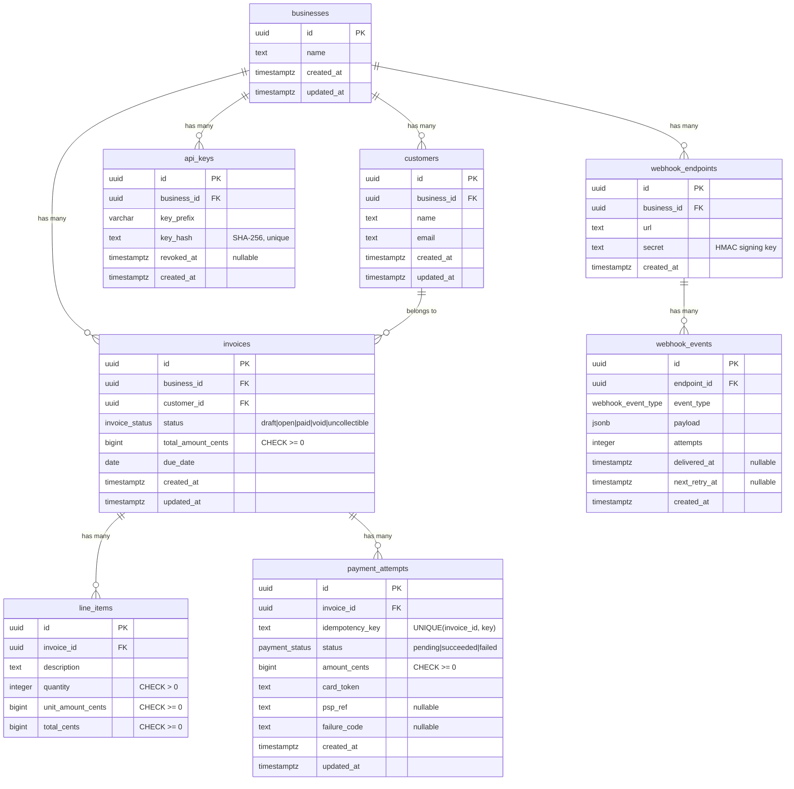
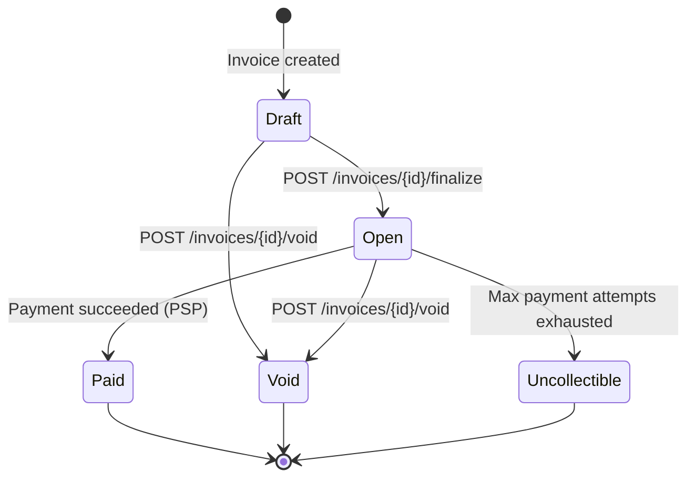

# Design Document

## 0. Architecture

### Crate Organization

```
crates/
  libs/
    lib-core/     → Config (OnceLock), Error/Result, domain models, BMCs
    lib-auth/     → Auth middleware (mw_auth), API key hashing
  services/
    invoice-service/  → Thin HTTP handlers, PSP client, webhook dispatcher
    mock-psp/         → Mock payment processor (separate binary)
```

**Dependency direction**: `services → lib-auth → lib-core`. Never reverse. Never circular.

### Backend Model Controller (BMC) Pattern

All database access is encapsulated in BMC structs (`CustomerBmc`, `InvoiceBmc`, `PaymentBmc`, `WebhookBmc`). Each provides a consistent interface:

- `create` / `get` / `list` — standard CRUD
- Domain-specific methods — `InvoiceBmc::finalize`, `InvoiceBmc::mark_paid`, `PaymentBmc::mark_succeeded`

Route handlers are thin: validate input → call BMC → map to response. Zero SQL in handlers.

### Request Context (Ctx)

Auth middleware inserts a `Ctx` (carrying `business_id`) into Axum request extensions. All BMC methods accept `&Ctx` to enforce business-scoping at the data layer, not just the route layer.

### Why this structure?

- **Enforced boundaries**: Crate dependency errors are compile-time errors
- **Faster incremental builds**: Changing a route handler recompiles only the service crate
- **Reusable**: Adding a second service (e.g., admin API) reuses lib-core and lib-auth
- **Testable**: BMCs can be tested independently of HTTP layer

---

## 1. Data Model

### ER Diagram



### Key Design Choices

- **UUID v4 primary keys**: No sequential IDs exposed externally. Prevents enumeration attacks and works well in distributed systems.
- **Integer money (BIGINT cents)**: No floating-point anywhere in the money path. CHECK constraints enforce non-negative values.
- **PostgreSQL enums**: `invoice_status`, `payment_status`, `webhook_event_type` — enforced at the DB level.
- **Idempotency index**: UNIQUE(invoice_id, idempotency_key) ensures one payment attempt per key per invoice.
- **Partial indexes**: `idx_api_keys_hash WHERE revoked_at IS NULL` — only active keys need fast lookup.
- **Cascade deletes**: Line items cascade with invoice deletion; payment attempts do not (audit trail).

### At 100x Scale

- Partition `invoices` and `payment_attempts` by `created_at` (range partitioning)
- Add read replicas for list/get queries
- Move webhook delivery to a dedicated queue (e.g., RabbitMQ/SQS) instead of tokio::spawn
- Consider sharding by `business_id` for multi-tenant isolation

---

## 2. Invoice State Machine



| From  | To            | Trigger                         | Reversible? |
| ----- | ------------- | ------------------------------- | ----------- |
| Draft | Open          | Business finalizes invoice      | No          |
| Draft | Void          | Business voids before sending   | No          |
| Open  | Paid          | Successful payment via PSP      | No          |
| Open  | Void          | Business cancels invoice        | No          |
| Open  | Uncollectible | Business marks as uncollectible | No          |

**Terminal states**: Paid, Void, Uncollectible — no transitions out.

**Invalid transition rejection**: The `InvoiceStatus::can_transition_to()` method validates transitions. API handlers check this before any UPDATE. The UPDATE query also includes a `WHERE status = <current>` condition, so even if a race occurs, the DB rejects the stale transition.

---

## 3. Payment Correctness & Failure Modes

### (a) Two concurrent POST /invoices/{id}/pay requests

**Mechanism**: PostgreSQL row-level lock via `SELECT ... FOR UPDATE` on the invoice row.

- First request acquires the lock, verifies status=open, inserts a payment_attempt, calls PSP
- Second request blocks on `FOR UPDATE` until first completes
- After first succeeds → invoice becomes "paid" → second sees status=paid → returns 409 Conflict

Additionally, the UNIQUE index on `(invoice_id, idempotency_key)` prevents duplicate attempts with the same key.

### (b) PSP times out (tok_timeout, 30s)

Our HTTP client has a **5-second timeout**. When the PSP doesn't respond in 5s:

1. reqwest returns a timeout error
2. Payment attempt stays in `pending` status
3. API returns **202 Accepted** with the pending payment attempt
4. Invoice remains in `open` state (not corrupted)
5. Caller can: retry with the same idempotency key, or poll `GET /invoices/{id}` for state

**Why 5s timeout**: Balances responsiveness with giving the PSP time for normal operations (~100ms). The 30s tok_timeout is treated as unreachable.

### (c) PSP returns success but service crashes before persisting

On retry (same idempotency key):

- The original payment_attempt is in `pending` state (inserted before PSP call)
- The retry will find it via idempotency key check
- Since it's still `pending`, we could re-call the PSP (the PSP should be idempotent with the same key)
- **No double-charge**: The PSP reference (psp_ref) would be the same if the PSP is idempotent

**Future improvement**: Store the PSP's idempotency key in the payment_attempt so we can reconcile.

### (d) Idempotency key reused with different request body

We detect this by comparing the `card_token` field. If it differs from the stored attempt, we return **409 Conflict** with a clear message: "Idempotency key already used with different request body."

### (e) Invoice in `paid` state receives POST /pay

The handler checks `invoice.status != Open` before processing. A paid invoice returns **409 Conflict**: "Cannot pay invoice in Paid state. Invoice must be in 'open' state."

### Concurrency Mechanism Choice

**Row-level lock (`SELECT ... FOR UPDATE`)** was chosen over:

- **Advisory locks**: More complex, harder to reason about cleanup on crashes
- **Optimistic concurrency (version column)**: Requires retry loops at the application level
- **Serializable isolation**: Too broad — serializes all transactions, not just conflicting ones
- **Status-conditional UPDATE**: Used as a secondary safety net, but doesn't prevent the PSP from being called twice

The FOR UPDATE lock is the most targeted — it blocks only concurrent writes to the same invoice row, while allowing unrelated invoices to proceed in parallel.

---

## 4. Webhook Design

### Signing Scheme

- **Algorithm**: HMAC-SHA256
- **What is signed**: The raw JSON payload body
- **Headers sent**:
  - `X-Webhook-Signature`: HMAC-SHA256 hex digest
  - `X-Webhook-Timestamp`: Unix timestamp (for replay protection)
  - `X-Webhook-Id`: Unique event ID (for deduplication)

**Replay protection**: Receivers should reject events with timestamps older than 5 minutes.

### Retry Policy

| Attempt | Delay     | Cumulative |
| ------- | --------- | ---------- |
| 1       | Immediate | 0 min      |
| 2       | 1 min     | 1 min      |
| 3       | 5 min     | 6 min      |
| 4       | 30 min    | 36 min     |
| 5       | 2 hours   | ~2.5h      |

- **Max attempts**: 5
- **Total retry budget**: ~2.5 hours (with a final 24h fallback if needed)
- **Backoff**: Escalating fixed intervals (1m, 5m, 30m, 2h, 24h)

### After exhausting retries

Events are marked as failed (attempts >= 5, delivered_at = NULL). Businesses can reconcile via:

- `GET /invoices` to check current state
- A future `/webhooks/events` endpoint to list undelivered events

### Decoupling from API response

Webhook delivery uses `tokio::spawn` — a fire-and-forget background task. The API response returns immediately after the database write. If delivery fails, the retry mechanism picks it up independently.

---

## 5. API Key Model

| Aspect           | Implementation                                                                                |
| ---------------- | --------------------------------------------------------------------------------------------- |
| **Generation**   | 32 random bytes → hex encoded with `dodo_` prefix (e.g., `dodo_test_key_1234567890abcdef`)    |
| **Storage**      | SHA-256 hash stored in DB. Plaintext NEVER stored.                                            |
| **Prefix**       | First 8 chars stored for identification/debugging without exposing the key                    |
| **Transmission** | Via `Authorization: Bearer <key>` header over HTTPS                                           |
| **Rotation**     | Create new key → test → revoke old key (set `revoked_at` timestamp)                           |
| **Revocation**   | Soft-delete via `revoked_at` column. Query filters: `WHERE revoked_at IS NULL`                |
| **Blast radius** | Key is scoped to one business. Leak exposes that business's data only. Revocation is instant. |

---

## 6. What I Cut and Why

1. **Pagination on list endpoints** — Would add cursor/offset logic. Mentioned here; would implement with keyset pagination (WHERE id > cursor) for production.
2. **Webhook event listing API** — A `GET /webhooks/events` endpoint for businesses to query undelivered events and reconcile missed webhooks. Would add for production.
3. **Rate limiting** — Would use token bucket per API key via tower middleware + Redis. Not built to stay within scope.
4. **Partial payments / refunds** — Requires a ledger model with credit/debit entries. Out of scope per requirements.
5. **Audit logging** — Every state change should be logged to an append-only audit table. Cut for time.

---

## 7. Production Readiness Gap

1. **Observability** — Need structured logging to a centralized system (e.g., Datadog/Grafana), metrics (Prometheus), and distributed tracing (OpenTelemetry). Currently only stdout logging.
2. **Rate limiting** — No protection against API abuse. Would implement per-key rate limits with token bucket algorithm.
3. **Webhook retry robustness** — Current retry worker uses a simple tokio::spawn polling loop. Production would use a dedicated job queue (e.g., RabbitMQ/SQS) with dead-letter handling for guaranteed delivery.
